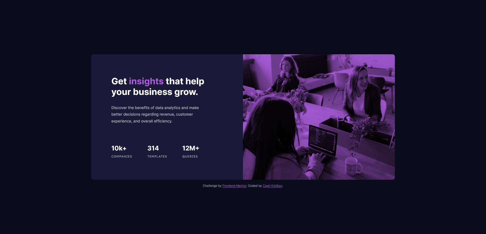

# Frontend Mentor - Stats preview card component solution

This is a solution to the [Stats preview card component challenge on Frontend Mentor](https://www.frontendmentor.io/challenges/stats-preview-card-component-8JqbgoU62). Frontend Mentor challenges help you improve your coding skills by building realistic projects.

## Table of contents

- [Overview](#overview)
  - [The challenge](#the-challenge)
  - [Screenshot](#screenshot)
  - [Links](#links)
- [My process](#my-process)
  - [Built with](#built-with)
  - [What I learned](#what-i-learned)
  - [Useful resources](#useful-resources)
- [Author](#author)

## Overview

### The challenge

Users should be able to:

- View the optimal layout depending on their device's screen size

### Screenshot




### Links

- Solution URL: [Frontend Mentor](https://www.frontendmentor.io/solutions/stats-preview-card-using-css-grid-and-mobilefirst-workflow-It3EMExBeC)
- Live Site URL: [Stats Preview Card](https://cgrkzlkn.github.io/stats-preview-card/)

## My process

### What I learned

Create a color overlay on image using mix-blend-mode in CSS:

```css
.card-img::after {
  content: "";
  position: absolute;
  top: 0;
  left: 0;
  width: 100%;
  height: 100%;
  background-color: var(--softviolet);
  mix-blend-mode: multiply;
}
```

### Built with

- Semantic HTML5 Markup
- CSS Grid
- CSS Custom Properties
- Mobile-First Workflow

### Useful resources

- Great video to learn about mix-blend-mode:

  - [Kevin Powell Youtube Video](https://youtu.be/TAA89nkEuhw)

## Author

- Website - [Cagri Kizilkan](https://cagrikizilkan.com)
- Frontend Mentor - [@cgrkzlkn](https://www.frontendmentor.io/profile/cgrkzlkn)
- Twitter - [@cgrkzlkn](https://www.twitter.com/cgrkzlkn)
